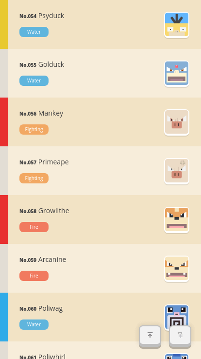
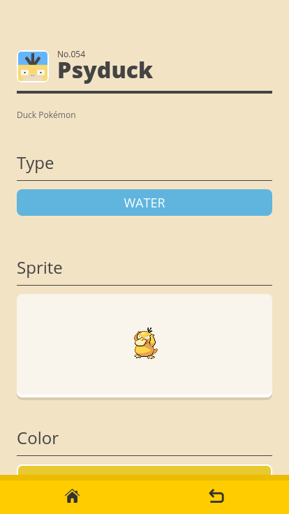
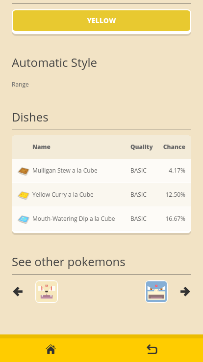
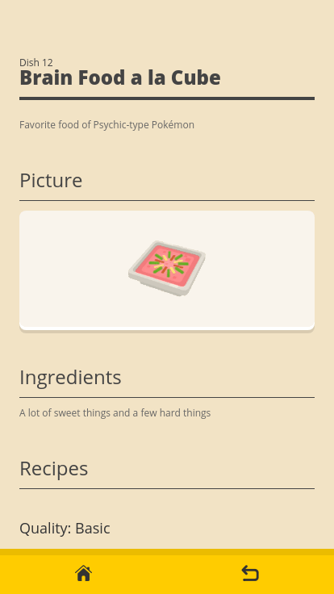
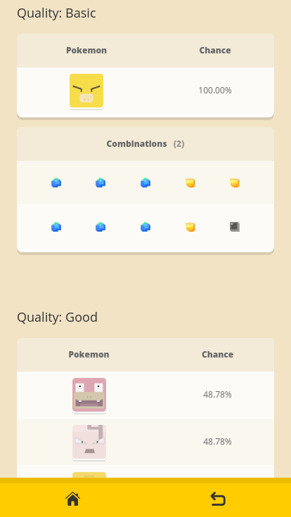
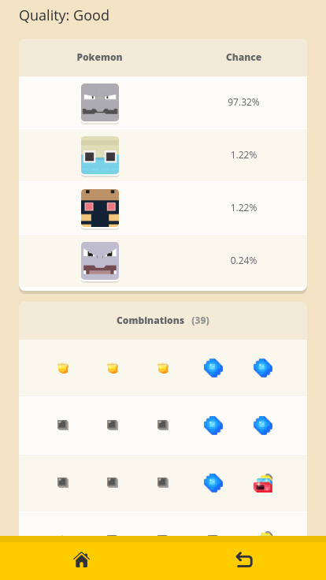

<h1 align="center">
  <p></p>
  <p>PokeQuest Wiki</p>
</h1>

> :closed_book: Pokémon Quest Dex designed for Web

## Live Version
:rocket: [https://pokequest.wiki](https://pokequest.wiki)

## Screenshots
<p>
  <a href="./_medias/screenshots/pokemon-list.png"></a>
  <a href="./_medias/screenshots/pokemon-list-filter.png"></a>
  <a href="./_medias/screenshots/pokemon-detail.png"></a>
  <a href="./_medias/screenshots/pokemon-detail-dishes.png"></a>
</p>
<p>
  <a href="./_medias/screenshots/dish-detail.png"></a>
  <a href="./_medias/screenshots/dish-detail-qualities.png"></a>
  <a href="./_medias/screenshots/dish-detail-example.png"></a>
</p>

## Features
- Full 151 Pokémons data
- Pecise Recipes data
- Allow to filter Pokémons
  - by types
  - by color
- Complete recipes for each of the Pokémons
- Designed for mobile
- Work offline
- Fully Static Site
- Progressive Web App
- Published on Github Page and Cloudflare

## Build Setup
Requires Node.js LTS

```bash
# install dependencies
npm install

# serve in dev mode, with hot reload at localhost:8080
npm run dev

# serve in production mode
npm run dev -- --mode production

# build for production
npm run build

# deploy to github page
npm run deploy
```

## Where did the production data come from?
- Pokémons data
  - https://www.serebii.net/quest/pokemon.shtml
- Recipe weights
  - https://www.reddit.com/r/PokemonQuest/comments/8uhl5o/pokemon_quest_mobile_datamining/
  - https://docs.google.com/spreadsheets/d/1UTudD9CA-ysSiYNX6iYIBEWmBbvvJiFgUCuZCm3ppWU
- Cooking assumptions
  - https://www.serebii.net/quest/cooking.shtml
  - https://docs.google.com/spreadsheets/d/11q35WaEXIVnfZwVBEKhjA9PaGNj13K-LJRoYh51YCPs
- Picture resources
  - https://www.serebii.net/quest/
  - https://pokequestrecipes.me/
  - https://github.com/PokeAPI/sprites

## What's not open source?
- A data generator (with crawlers)
  - https://github.com/imyelo/pokequest-wiki-toolbox/tree/master/packages/joltik
- Complete production data
  - https://github.com/imyelo/pokequest-wiki-data

## License
MIT @ yelo

----

<p align="center"></p>
